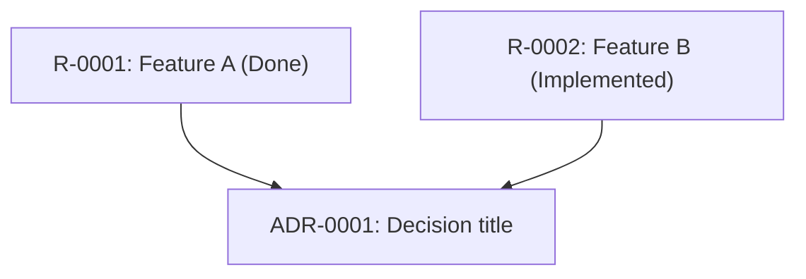

# Memory Transform Format Guide

## Supported Output Formats

---

## Mermaid — Dependency and Status Graphs

**Best for**: quick status overviews, requirement dependency visualization, requirement-to-ADR mapping.

**Command**:

```bash
node <SKILL_DIR>/scripts/export-memory-graph.mjs --format=mermaid
```

**Output structure** (graph TD):



**Conventions**:

- Node IDs use the requirement or ADR ID
- Node labels use format `ID: Short title (Status)`
- Edges represent explicit dependencies or references
- Requirements in `Done` status are shown with green fill when rendered
- Requirements `Blocked` are shown with red fill

**Limitations**: Mermaid does not support grouping by phase or folder — use DOT for that.

---

## DOT — Graphviz Graph

**Best for**: richer layouts, hierarchical views, cluster grouping by phase.

**Command**:

```bash
node <SKILL_DIR>/scripts/export-memory-graph.mjs --format=dot --out=memory-graph.dot
```

Render to image:

```bash
dot -Tpng memory-graph.dot -o memory-graph.png
dot -Tsvg memory-graph.dot -o memory-graph.svg
```

**Conventions**:

- Use `subgraph cluster_phase` to group requirements by phase (02-requirements, 03-plans, etc.)
- Node shape: `box` for requirements, `diamond` for ADRs, `ellipse` for phases
- Edge style: `solid` for hard dependency, `dashed` for reference

---

## Obsidian — Markdown Vault

**Best for**: navigable knowledge base where each requirement, ADR, evaluation, and decision is a separate note with wiki-style `[[backlinks]]`.

**Command**:

```bash
node <SKILL_DIR>/scripts/export-memory-graph.mjs --format=obsidian --out=<target-dir>
```

**Output structure**:

```
<target-dir>/
  Requirements/
    R-0001 - Feature A.md
    R-0002 - Feature B.md
  Decisions/
    ADR-0001 - Title.md
  Evaluations/
    R-0001 - Evaluation.md
  _index.md
```

**Conventions**:

- Every note has a YAML frontmatter block with `id`, `status`, `phase`, `created`, `updated`
- Links use `[[R-0001 - Feature A]]` format (Obsidian wiki links)
- Requirements link to their plan, execution, and evaluation notes
- ADRs link back to the requirements that reference them

---

## Canonical Memory Preservation Rules

**Never mutate** `docs/agent-memory/` directly as part of a transform. Generated output goes to a separate path.

Permitted output locations:

- `docs/reports/` — for dashboards and narrative reports
- Any path the user explicitly specifies
- A temp path outside the workspace if the user is exploring

Always write the list of generated files as part of the skill output so the user knows what was created and where.
